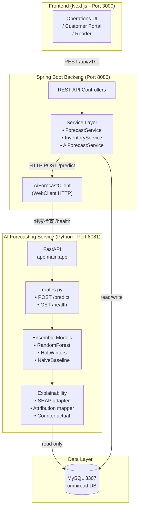
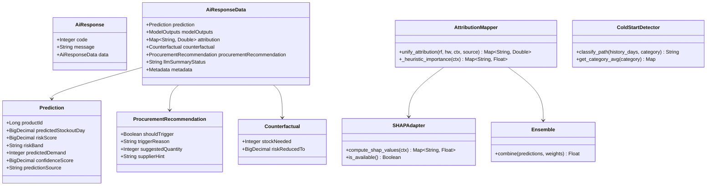
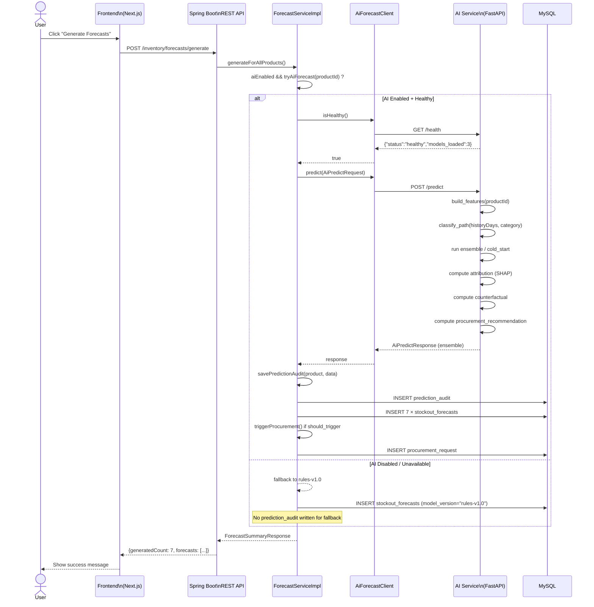
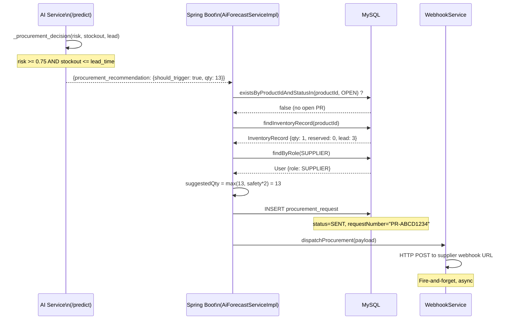
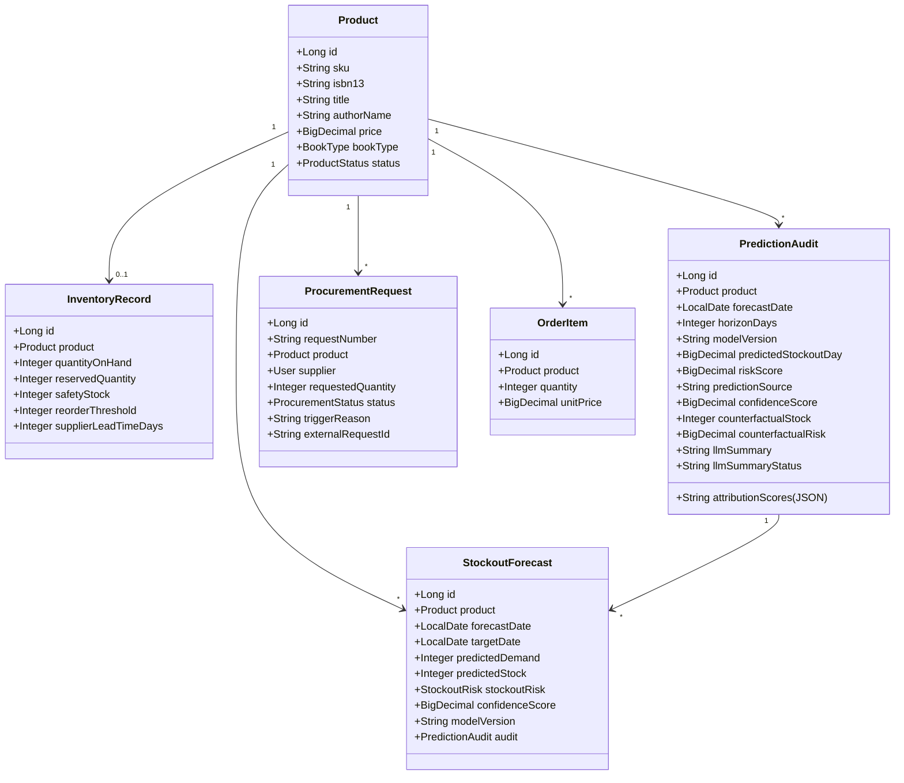
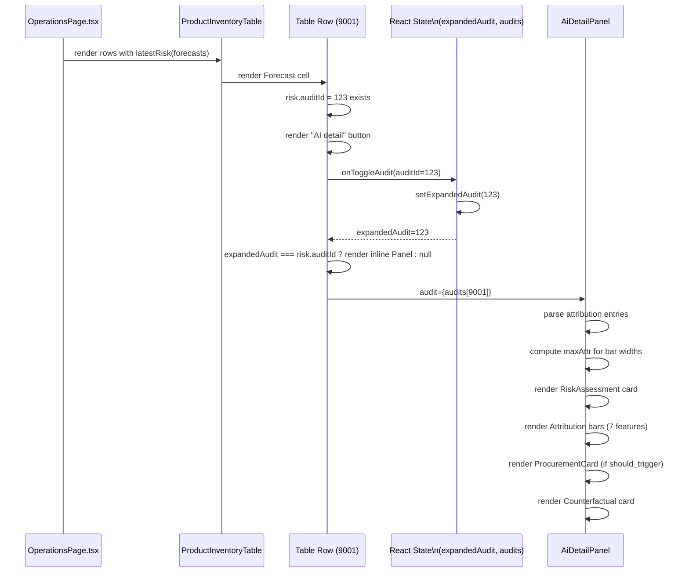

# UML Diagrams — OmniRead MVP

All diagrams use [Mermaid](https://mermaid.js.org/) syntax. Render in GitHub, VS Code (Mermaid preview), or any Mermaid-compatible viewer.

---

## 1. System Architecture



---

## 2. Class Diagram (AI Service)



---

## 3. Sequence Diagram — Forecast Generation Flow



---

## 4. Sequence Diagram — Procurement Trigger Flow



---

## 5. Dialog Map (UI Navigation)

```mermaid
flowchart LR
    subgraph Entry["Entry Points"]
        LOGIN[/"Login Page\n/logout"]
        HOME[/"Home\n/"]
    end

    subgraph Customer["Customer Flow"]
        SHOP[/"Shop\n/shop"]
        CART[/"Cart\n/cart"]
        ORDERS[/"My Orders\n/orders"]
        BOOK[/"Book Detail\n/book/:id"]
        EPUB[/"EPUB Reader\n/reader/:id"]
    end

    subgraph Operations["Operations Flow"]
        OPS[/"Operations Portal\n/operations"]
        STOCK[/"Stock Settings\n(Edit product)"]
        FORECAST[/"Forecast Panel\n(AI detail expand)"]
        PROC[/"Procurement\nRequests"]
    end

    LOGIN -->|Success| HOME
    HOME -->|role=ADMIN| OPS
    HOME -->|role=CUSTOMER| SHOP
    SHOP --> BOOK
    BOOK --> CART
    CART --> ORDERS
    ORDERS --> HOME

    OPS --> STOCK
    OPS --> FORECAST
    OPS --> PROC
    STOCK -->|Select product| OPS

    style LOGIN fill:#e1f5fe
    style OPS fill:#fff3e0
    style SHOP fill:#e8f5e9
    style BOOK fill:#e8f5e9
```

---

## 6. Class Diagram — Backend Domain Model



---

## 7. Sequence Diagram — AI Detail Panel Expansion (Frontend)



---

*Diagrams version 1.0 — for Submission #3 (Week 9)*
*Generated from code analysis 2026-05-03*